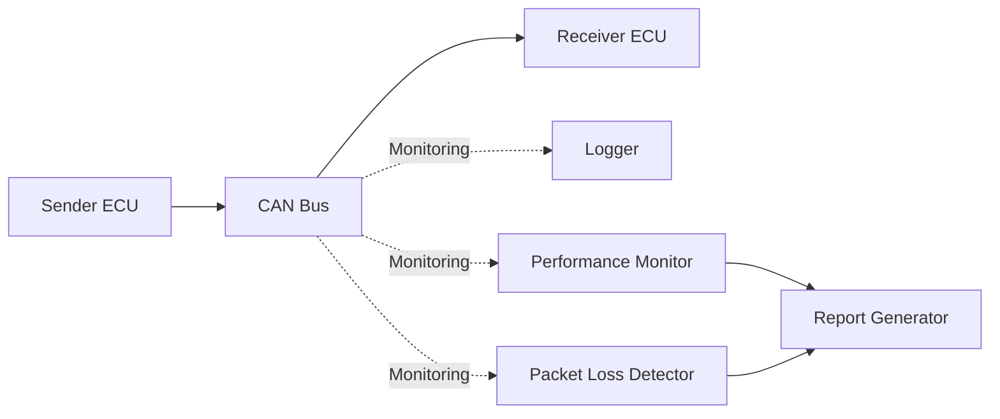
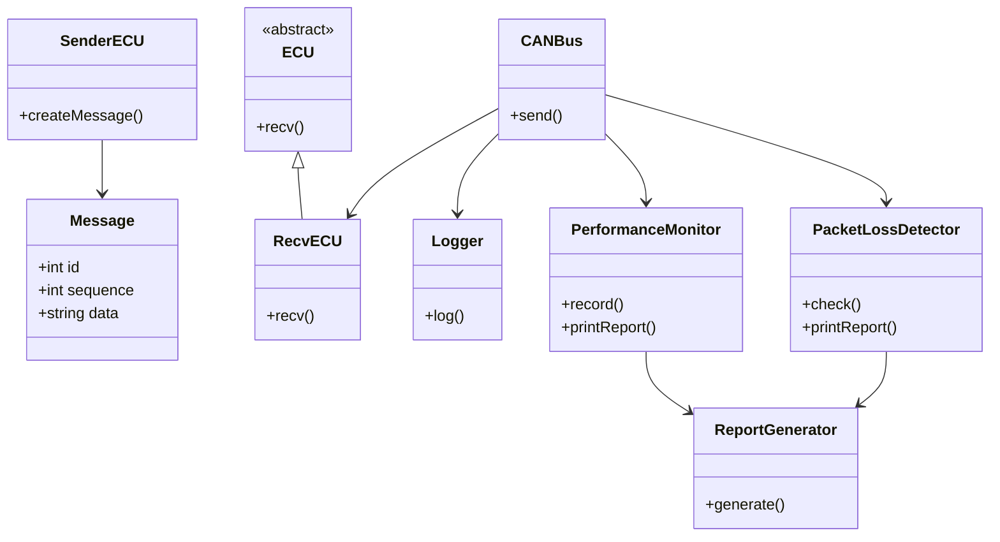

# Vehicle Simulation & Analysis Platform

車載ECU間通信を模擬し、通信品質を評価するためのC++製シミュレーションプラットフォームです。

本プロジェクトは、車載ソフトウェア開発および通信評価業務で得た知見をもとに、

- ECU通信
- 通信ログ取得
- 遅延測定
- パケットロス検知
- スループット測定
- 品質保証

を再現することを目的として開発しています。

---

## Overview



---

## Features

### Communication Simulation

- ECU通信シミュレーション
- CAN通信レイヤ抽象化
- Message転送

### Communication Analysis

- Latency Measurement
- Packet Loss Detection
- Throughput Measurement

### Reporting

- Communication Log Output
- Performance Report Generation

### Quality Assurance

- GoogleTest
- CTest
- CMake Build System

---

## Architecture



---

## Measured Metrics

Currently supported metrics:

| Metric | Description |
|----------|----------|
| Latency | Message transfer delay |
| Packet Loss | Missing sequence detection |
| Throughput | Messages per second |
| Message Count | Total processed messages |

Example Output:

```text
=== Performance Report ===

Message Count : 9999

Average Latency : 0.0857438 ms

Min Latency : 0.017633 ms

Max Latency : 193.516 ms

Elapsed Time : 0.86273 sec

Throughput : 11589.9 msg/sec

Packet Loss Count = 1
```

---

## Report Example

Generated file:

```text
reports/report.txt
```

Example:

```text
=== Vehicle Communication Report ===

Message Count : 9999

Average Latency : 0.0857438 ms

Min Latency : 0.017633 ms

Max Latency : 193.516 ms

Elapsed Time : 0.86273 sec

Throughput : 11589.9 msg/sec

Packet Loss Count : 1
```

---

## Unit Tests

Implemented using GoogleTest.

### PacketLossDetector

- No Loss Scenario
- Packet Loss Detection Scenario

### SenderECU

- Message Creation
- Sequence Increment Verification

### CANBus

- Message Transfer Verification

Test Result:

```text
100% tests passed
```

---

## Directory Structure

```text
vehicle-simulation-platform

├── includes
│   ├── can_bus.hpp
│   ├── ecu.hpp
│   ├── logger.hpp
│   ├── message.hpp
│   ├── packet_loss_detector.hpp
│   ├── performance_monitor.hpp
│   ├── recv_ecu.hpp
│   ├── report_generator.hpp
│   └── sender_ecu.hpp
│
├── src
│   ├── main.cpp
│   ├── sender.cpp
│   └── receiver.cpp
│
├── tests
│   ├── test_packet_loss.cpp
│   ├── test_sender.cpp
│   └── test_can_bus.cpp
│
├── logs
├── reports
├── build
│
└── CMakeLists.txt
```

---

## Build

```bash
mkdir build

cd build

cmake ..

make
```

---

## Run Tests

```bash
cd build

ctest --verbose
```

---

## Current Status

### Completed

- ECU Communication Simulation
- Communication Logging
- Latency Measurement
- Packet Loss Detection
- Throughput Measurement
- Report Generation
- GoogleTest
- CTest
- CMake

### Planned

- GitHub Actions (CI)
- CSV Log Export
- SocketCAN Integration
- Linux vcan Support

---

## Background

車載通信評価では以下を確認する必要がある。

- 通信できること
- 遅延が許容範囲であること
- パケットが欠損しないこと
- 十分な通信性能があること

また、SenderECUで生成したMessageをCANBusクラス経由でRecvECUへ転送する構成としています。CANBusは通信経路の役割だけでなく、Loggerによるログ取得、PerformanceMonitorによる遅延・スループット計測、PacketLossDetectorによる欠損検知を実施しています。また、これらの評価結果をReportGeneratorでレポートとして出力できるようにし、通信シミュレータだけでなく通信品質評価プラットフォームとして利用できる構成にしています。

