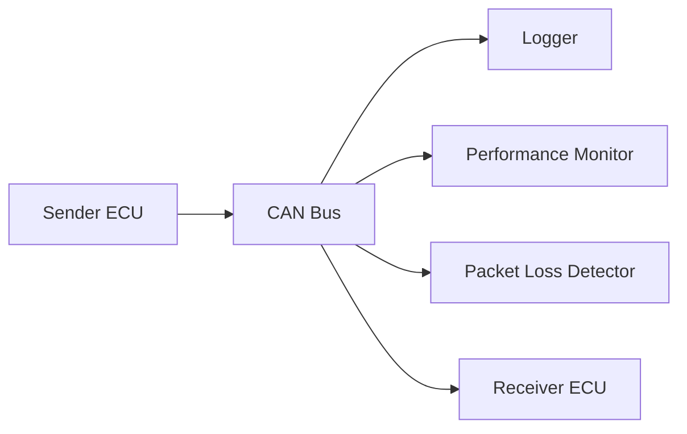

# Vehicle Simulation & Analysis Platform

車載ECU間通信を模擬し、通信品質の評価を行うためのC++製シミュレーションプラットフォームです。

本プロジェクトは、車載ソフトウェア開発・通信評価業務で得た知見をもとに、ECU通信、ログ取得、性能測定、品質評価を再現することを目的として開発しています。

## Features

- CAN Communication Simulation
- Communication Logger
- Latency Measurement
- Packet Loss Detection
- Throughput Measurement
- Report Generation (Next)
- GoogleTest (Planned)
- SocketCAN Integration (Planned)

---

## Overview

出力例)
以下のように最大値が平均と比べて突出している場合、
VSCode Codespaces負荷、OSスケジューリングやログ出力の影響が想定される。

Average Latency : 0.119836 ms
Max Latency : 470.291 ms

